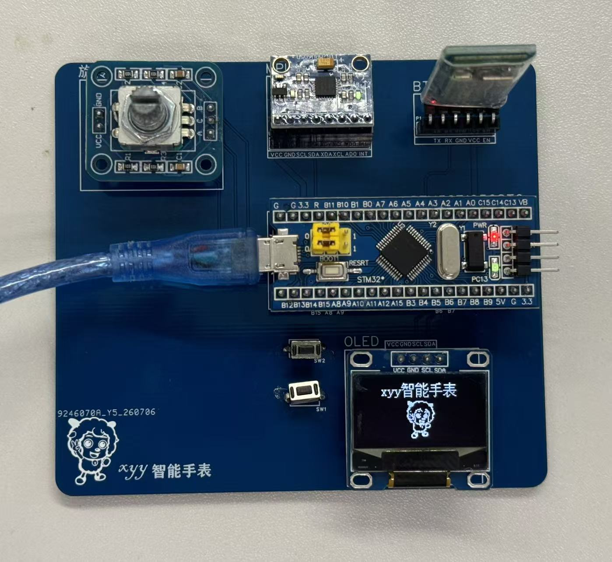
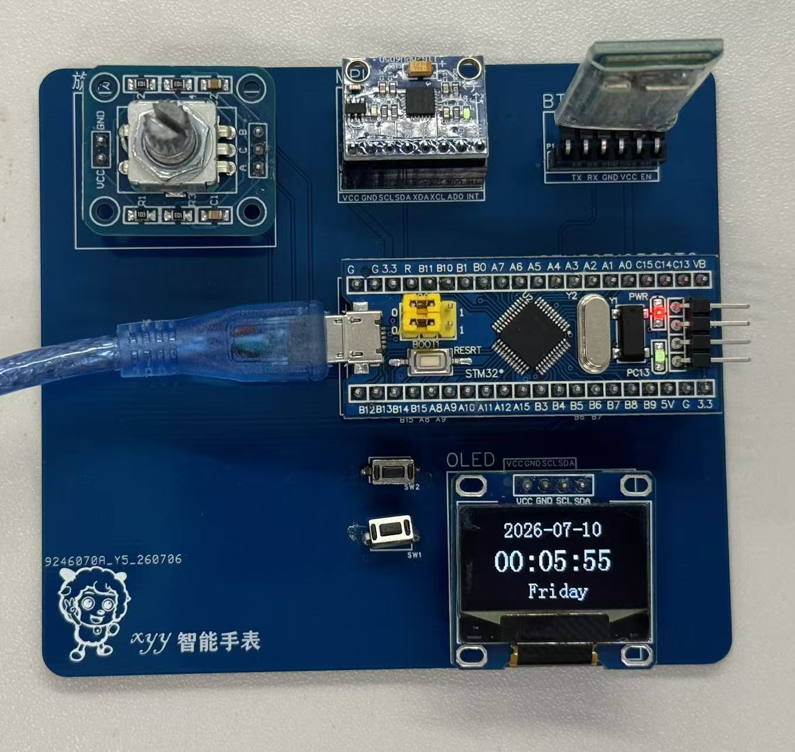
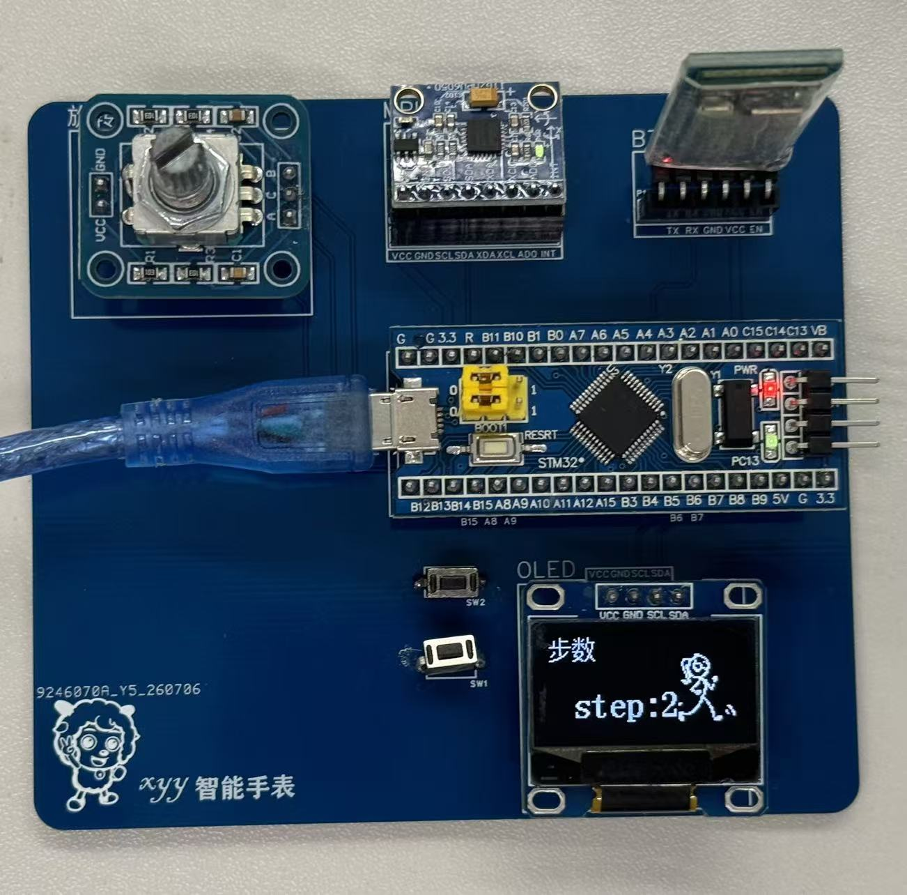
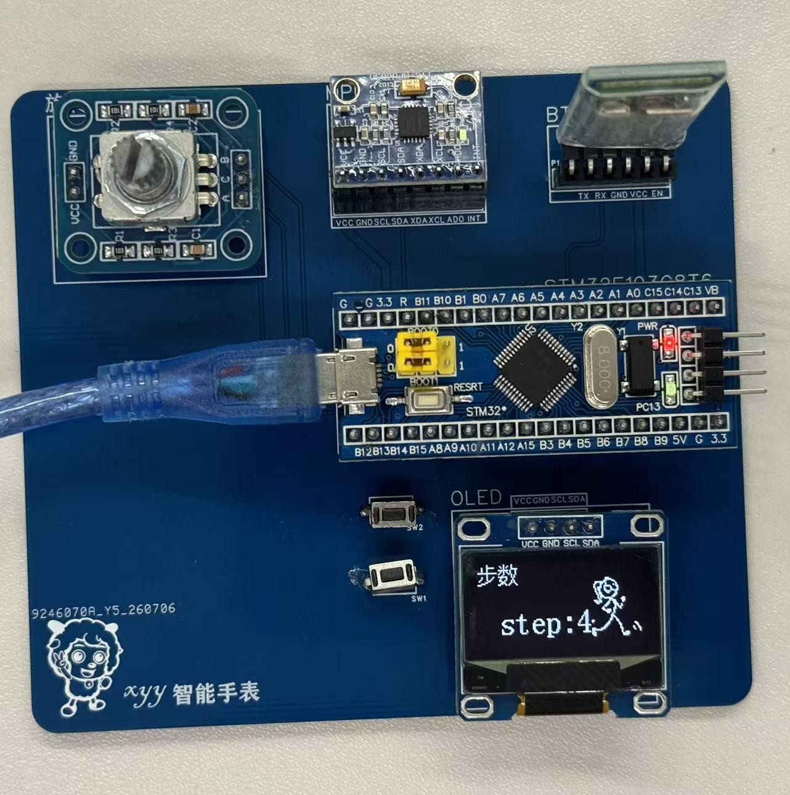
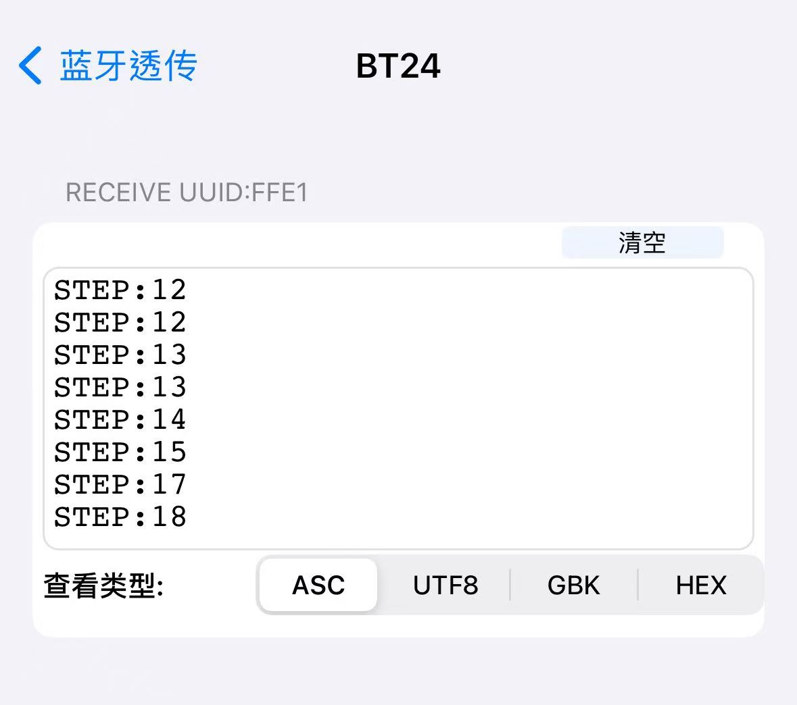
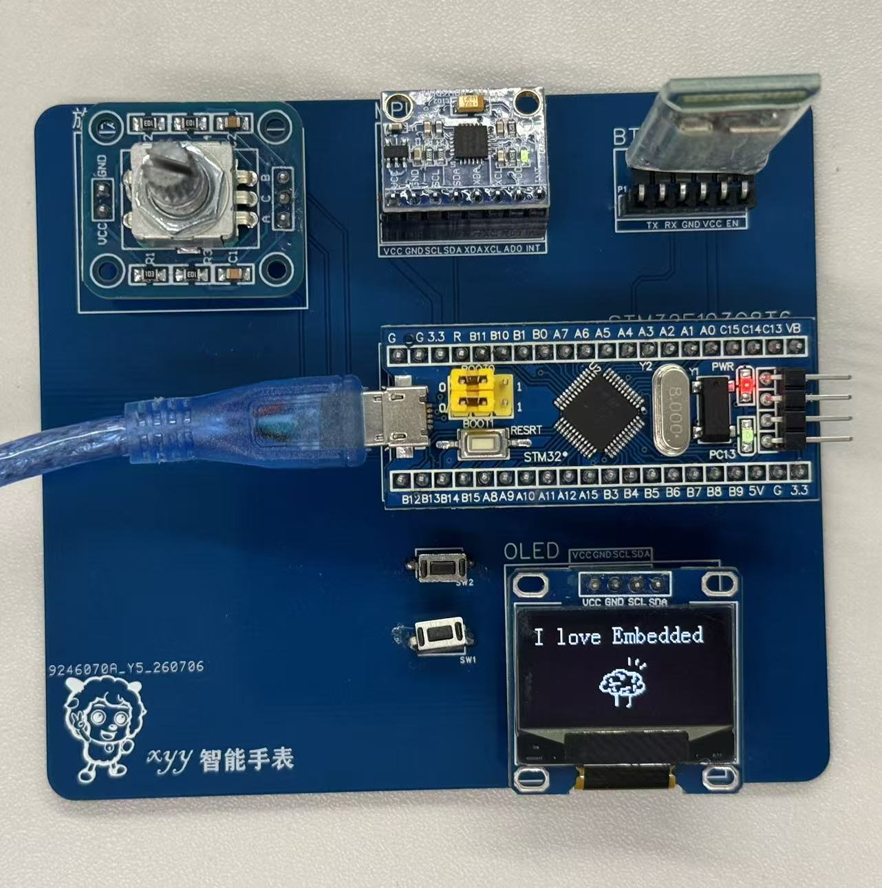
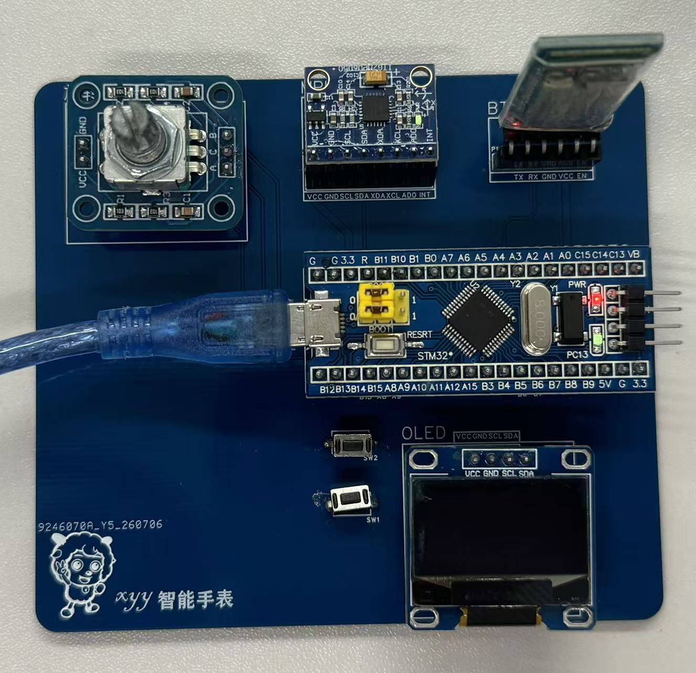
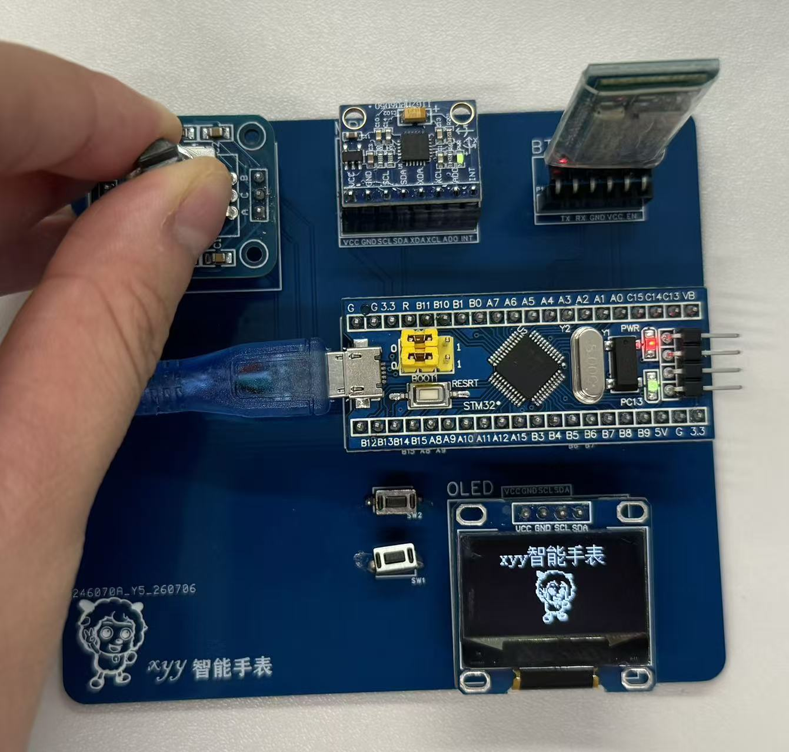
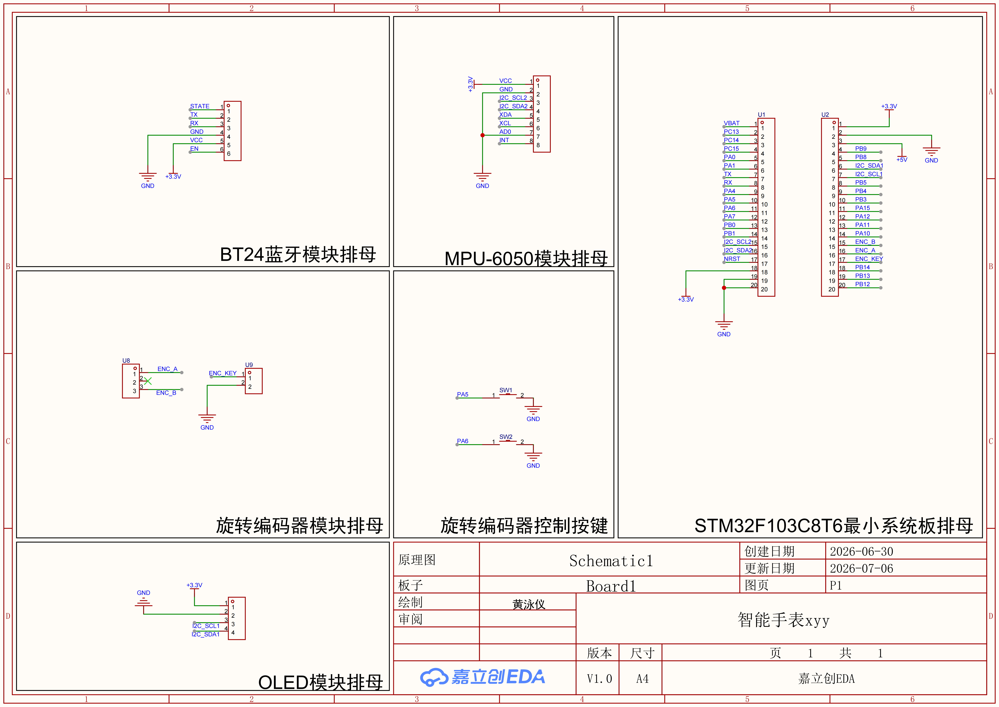
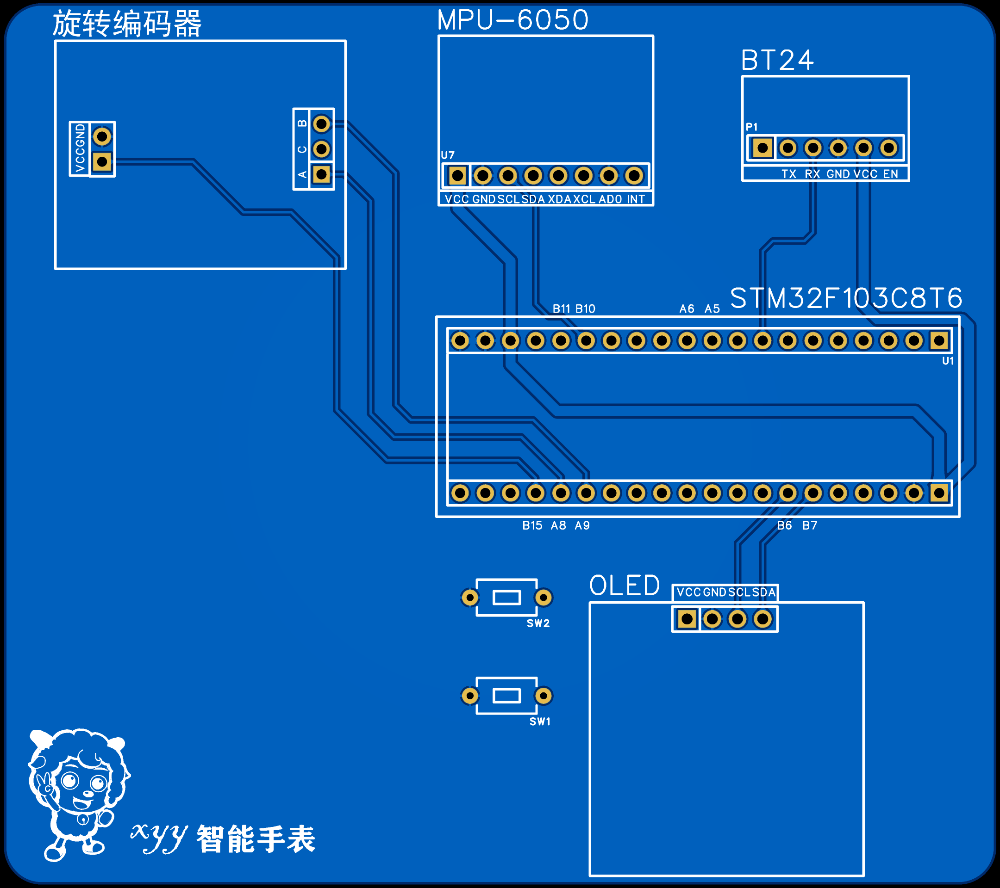

# 智能手表课程设计功能汇报

# 一、软件功能

## 1. OLED显示功能

采用0.96英寸SSD1306 OLED显示屏作为人机交互界面，实现系统信息的实时显示。OLED界面可显示时间、步数等信息，并通过菜单切换实现不同功能页面的显示。

## 2. 时间显示功能

系统采用RTC模块进行计时。设备上电后即可实时显示当前时间，即使系统复位，只要RTC持续供电，时间信息仍可保持连续运行，无需重新校时。

## 3. 步数统计功能

利用MPU6050三轴加速度传感器采集人体运动数据，通过步态检测算法对加速度信号进行滤波、动态阈值判断及峰值检测，实现步数统计。统计结果实时更新，并显示在OLED屏幕上。

         

## 4. 蓝牙数据传输功能

采用BT24蓝牙模块与手机建立无线通信连接，实时发送当前步数信息，实现运动数据的无线传输，为后续移动端数据显示提供基础。

## 5. 菜单切换功能

采用EC11旋转编码器作为人机交互输入设备。用户旋转旋钮可切换OLED菜单页面，实现简单直观的菜单操作。

## 6. 电源管理功能

为了降低系统功耗，设计了自动休眠与唤醒机制。

- 当旋转编码器连续10秒无操作时，系统自动关闭OLED显示，仅保持RTC计时、MPU6050采集及蓝牙通信等后台功能运行。

- 当再次旋转旋转编码器时，OLED立即点亮，并恢复至主界面显示.

使得系统具有较好的交互性和低功耗性能，在保证正常工作的同时有效降低了整机功耗。

------

# 二、硬件设计

## 1. PCB设计

本项目使用嘉立创EDA完成原理图绘制及PCB设计，根据智能手表功能需求完成各功能模块的电路设计，并进行PCB布局布线。

PCB主要包括STM32F103C6T6最小系统板、MPU6050六轴传感器、OLED显示屏幕、BT24蓝牙通信模块、EC11旋转编码器。

在PCB设计过程中，充分考虑了模块之间的连接关系、供电稳定性以及信号完整性，对电源线和通信线路进行了合理布局，使整块电路板结构紧凑、布线规范，便于焊接和后期调试。

完成PCB设计后，生成Gerber文件并进行打板制作，最终完成整板焊接与功能验证。

------

# 三、系统特色

- 基于FreeRTOS实现多任务并发运行，系统响应速度快。
- 支持时间显示、运动计步、蓝牙通信等多种功能。
- 采用动态阈值步态检测算法，提高计步准确率。
- 引入自动休眠机制，有效降低OLED显示功耗。
- 采用旋转编码器实现菜单操作，人机交互简单直观。
- 模块化软件设计，便于后续增加心率检测、温度监测等功能。

------

# 四、实现效果

本智能手表实现了时间显示、运动计步、OLED菜单显示、蓝牙数据传输以及自动休眠等功能。系统运行稳定，各模块通信正常，完成了课程设计的基本要求以及拓展要求。
