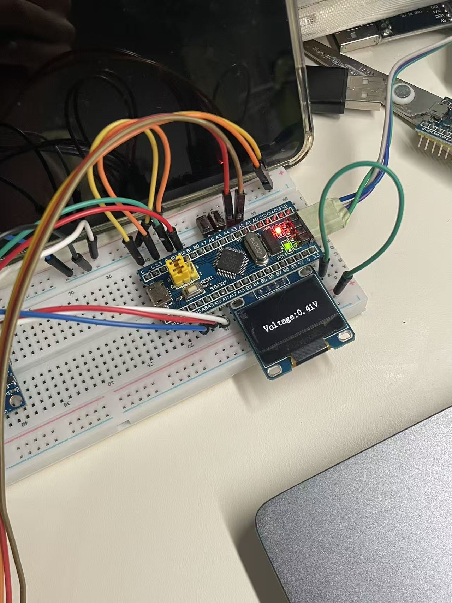

# 中期检查报告

组别： xyy

提交日期：2026-07-06

## 物料到位总览

已到位：OLED模块、BT24蓝牙模块、MPU_6050陀螺仪模块、旋转编码器模块，STM32最小系统板、2p排母*1 、 3p排母*1  、  6p排母*1  、 8p排母*1  、 20p排母*2       

未到位：4p排母*1 （明日可到）    

## 当前完成进度

#### 1、已完成工作

 物资的购买及清点、PCB原理图及PCB的绘制、各个模块的调试、代码编写

#### 2、进行中工作

 PCB打板、最后调试、功能拓展

## 硬件调试情况

#### 1、各模块测试结果

旋转编码器、蓝牙模块BT24、oledssd1360、mpu6050均已调试完成，可以正常使用

#### 2、遇到的问题与解决措施

（1）旋转编码器按键故障 

放弃旋转编码器自带的按键更改为新的直插按键

（2）充电宝上电只能维持一分钟！！！

## 软件调试情况

#### 1、各功能开发进度

（1）oled：能够显示多个界面 实时显示数据无卡顿

（2）蓝牙：顺利连接手机，并发送计步数据

（3）计步功能：较为精准地计算步数，误差在5步以内

（4）旋转编码器：转动旋转编码器能够丝滑切换界面

#### 2、已通过的测试用例

#

## 存在的问题与风险

#### 1、技术难点、物料延期等风险及应对方案

（1）烧录经常遇见问题！！！

（2）同样的代码 adc读取电压值第一次烧录可以保持在4.5-5V 第三四次烧录后只有0.几V！！！

## 后续工作计划

（1）待PCB打板完成后将各个模块转移至PCB板上再次调试

（2）继续增加手表功能 eg.休眠-唤醒功能、界面设置功能

