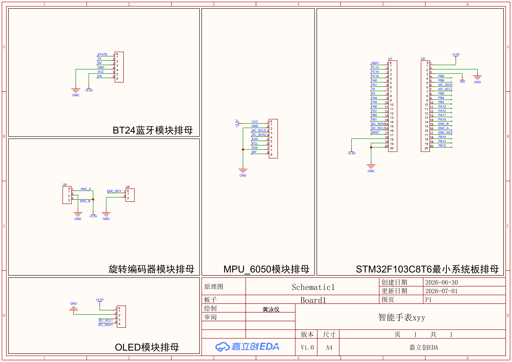
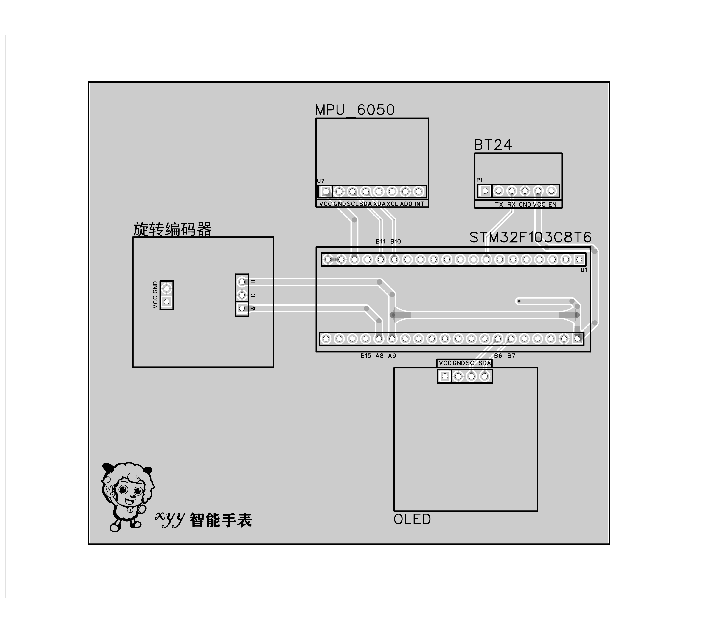
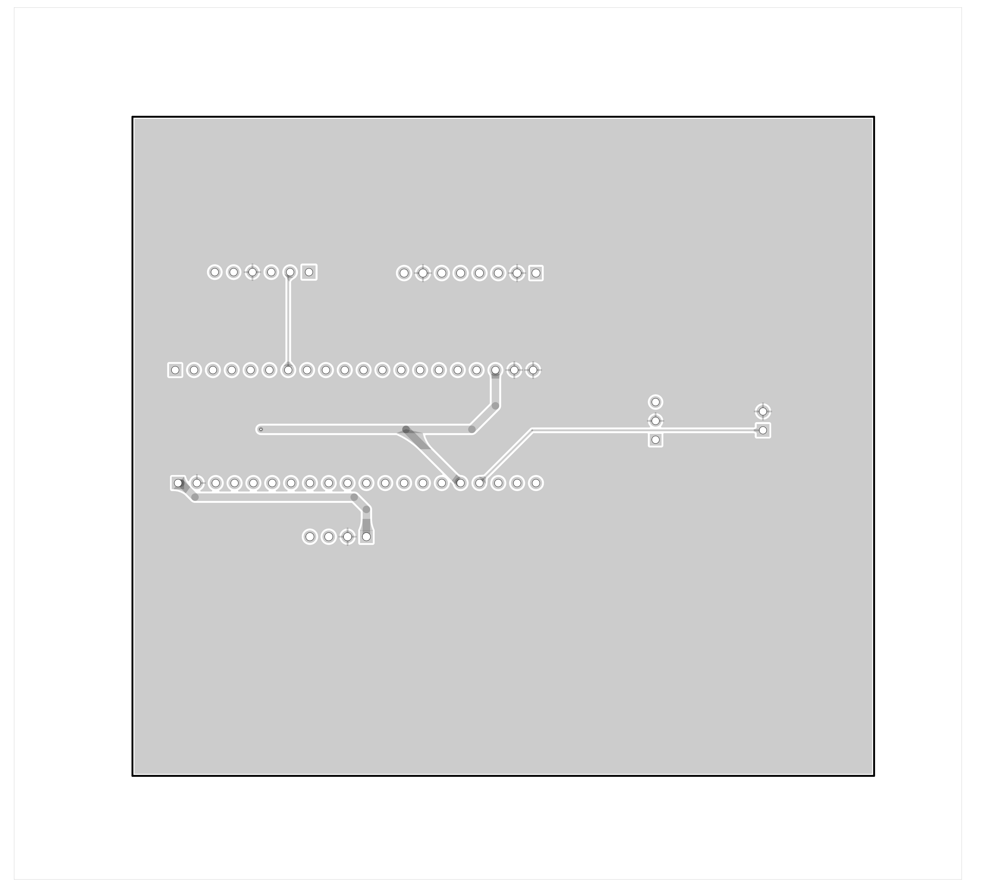
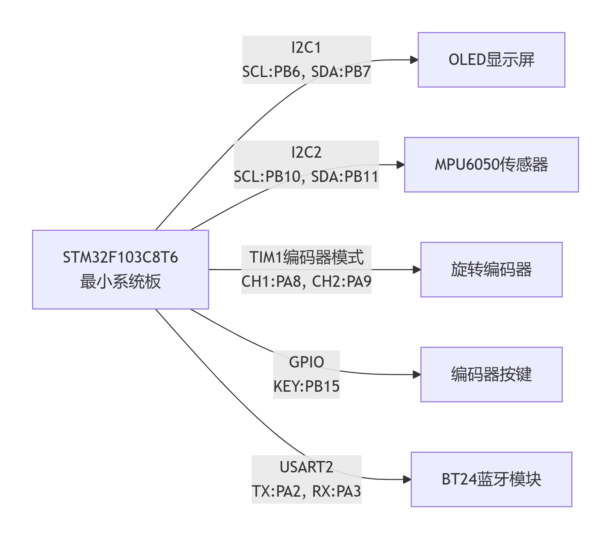

# 系统设计文档

组别： xyy

提交日期：2026-07-02

## 已到货物清单与实物核对情况

OLED模块、BT24蓝牙模块、MPU_6050陀螺仪模块、旋转编码器模块，都已到齐且核对完毕

## 未到货物料预计到位时间

2p排母*1 、 3p排母*1  、 4p排母*1  、 6p排母*1  、 8p排母*1  、 20p排母*2、PCB打板

7.3前可全部到齐

## 硬件部分进度

#### 1、PCB原理图

#### 2、PCB布局

#### 3、硬件框图

## 软件部分进度

#### 1、模块划分

旋转编码器、蓝牙模块BT24、oledssd1360、mpu6050

#### 2、外设配置方案

(1)oled：I2C1

(2)MPU6050:I2C2

(3)旋转编码器：TIM1+PB15

(4)蓝牙：uart2

#### 3、关键算法描述

没到那步

#### 4、FreeRTOS任务划分

(1)UITask：负责编码器控制oled界面、oled显示

(2)MPU6050Task：数据读取+计步算法

(3)ServiceTask：rtc时间读取+蓝牙发送

#### 5、进度汇报

(1)了解所有外设的使用

(2)了解FREERTOS原理

(3)初步开始编写项目代码
